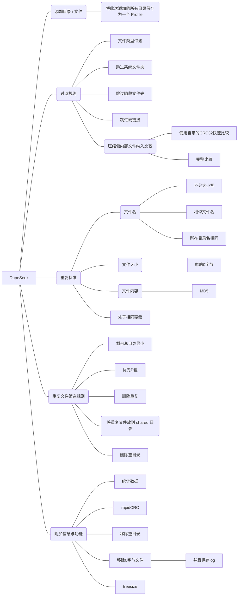

```mermaid
flowchart LR
    A[DupeSeek] --- B(添加目录 / 文件) --- B1(将此次添加的所有目录保存为一个 Profile)

    A --- C(过滤规则) --- 文件类型过滤
            C --- 跳过系统文件夹
            C --- 跳过隐藏文件夹
            C --- 跳过硬链接
            C --- C5( 压缩包内部文件纳入比较) --- 使用自带的CRC32快速比较
                  C5---完整比较

    A ---D(重复标准) --- D1(文件名) --- 不分大小写
                        D1 --- 相似文件名
                        D1 --- 所在目录名相同
         D --- D2(文件大小) --- 忽略0字节
         D --- D3(文件内容) --- MD5
         D --- 处于相同硬盘
         
    A --- E(重复文件筛选规则) --- 剩余总目录最小
          E --- 优先D盘
          E --- 删除重复
          E --- E4(将重复文件放到 shared 目录)
          E --- 删除空目录

    A --- F(附加信息与功能) --- 统计数据
          F --- rapidCRC
          F --- 移除空目录
          F --- 移除0字节文件 --- 并且保存log
          F --- treesize

```